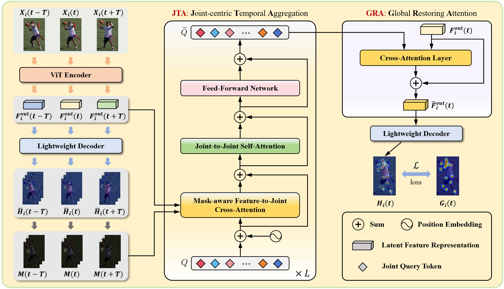
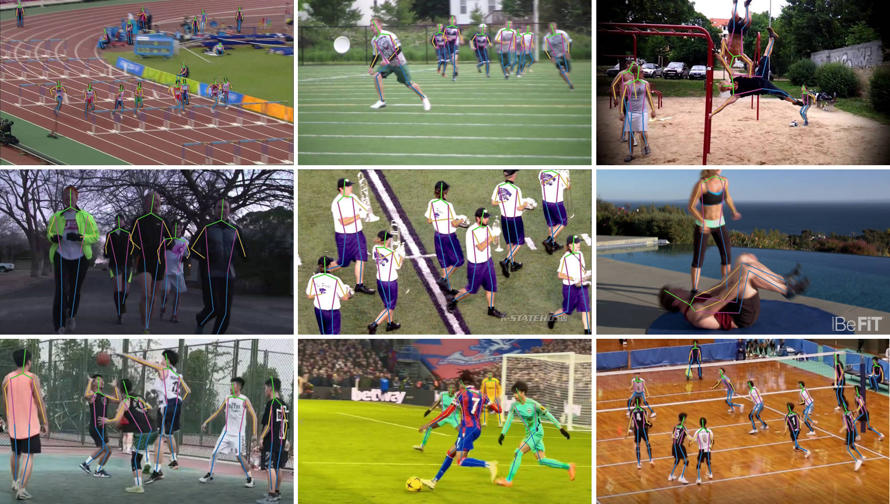

# Beyond Static Frames: Temporal Aggregate-and-Restore Vision Transformer for Human Pose Estimation

This repo is the official implementation for **Beyond Static Frames: Temporal Aggregate-and-Restore Vision Transformer for Human Pose Estimation**[[arXiv](https://arxiv.org/abs/2403.19926)]. The paper has been accepted to [CVPR 2026](https://cvpr.thecvf.com/Conferences/2026).


## Introduction

Vision Transformers (ViTs) have recently achieved stateof-the-art performance in 2D human pose estimation due to their strong global modeling capability. However, existing ViT-based pose estimators are designed for static images and process each frame independently, thereby ignoring the temporal coherence that exists in video sequences. This limitation often results in unstable predictions, especially in challenging scenes involving motion blur, occlusion, or defocus. In this paper, we propose TAR-ViTPose, a novel Temporal Aggregate-and-Restore Vision Transformer tailored for video-based 2D human pose estimation. TAR-ViTPose enhances static ViT representations by aggregating temporal cues across frames in a plug-and-play manner, leading to more robust and accurate pose estimation. To effectively aggregate joint-specific features that are temporally aligned across frames, we introduce a joint-centric temporal aggregation (JTA) that assigns each joint a learnable query token to selectively attend to its corresponding regions from neighboring frames. Furthermore, we develop a global restoring attention (GRA) to restore the aggregated temporal features back into the token sequence of the current frame, enriching its pose representation while fully preserving global context for precise keypoint localization. Extensive experiments demonstrate that TAR-ViTPose substantially improves upon the single-frame baseline ViTPose, achieving a +2.3 mAP gain on the PoseTrack2017 benchmark. Moreover, our approach outperforms existing stateof-the-art video-based methods, while also achieving a noticeably higher runtime frame rate in real-world applications.



## Weights Download
We provide the model weights trained by the method in this paper, which can be downloaded here.
https://drive.google.com/drive/folders/1zmQaK56IHOJIf1AQ8ZWZbq0UtBRmsPuI?usp=drive_link

## Visualizations
Here are some qualitative results from both the PoseTrack dataset and real-world scenarios:



## Environment

The code is developed and tested under the following environment:

- Python 3.11.6
- PyTorch 2.0.1
- CUDA 11.8

```
conda create -n tarvitpose pyhton=3.11.6
conda activate tarvitpose
conda install pytorch==2.0.1 torchvision==0.15.2 torchaudio==2.0.2 pytorch-cuda=11.8 -c pytorch -c nvidia
cd tarvitpose
pip install -r requirements.txt
```

## Usage
To download some auxiliary materials, please refer to [DCPose](https://github.com/Pose-Group/DCPose).

Follow the [**MMPose instruction**](https://mmpose.readthedocs.io/en/latest/installation.html) to install the mmpose.

### Training
```
cd tools
python train.py --config ../configs/posetrack17/tarvitpose.yaml 
```
### Evaluation
```
cd tools
python val.py --config ../configs/posetrack17/tarvitpose.yaml --weights_path /path/to/weights.pt
```
### Video Inference
```
cd tools
python inference.py -c ../configs/posetrack17/tarvitpose.yaml -w /path/to/weights.pt -i input_video.mp4

```

## Citations

If you find our paper useful in your research, please consider citing:

```bibtex
@InProceedings{fang_2026_tarvitpose,
    author    = {Fang, Hongwei and Cai, Jiahang and Wang, Xun and Yang, Wenwu},
    title     = {Beyond Static Frames: Temporal Aggregate-and-Restore Vision Transformer for Human Pose Estimation},
    booktitle = {Proceedings of the IEEE/CVF Conference on Computer Vision and Pattern Recognition (CVPR)},
    year      = {2026},
}
```

## Acknowledgment

Our codes are mainly based on [Poseidon](https://github.com/CesareDavidePace/poseidon) and [MMPose](https://mmpose.readthedocs.io/en/latest). Many thanks to the authors!